# andata
# 📊 Анализ мошенничества по транзакционным данным

Этот репозиторий содержит визуализации, отражающие закономерности мошеннических транзакций. Все графики сохраняются в папку `plots/`.

Визуализации позволяют определить, в каких категориях, временных промежутках, странах и других характеристиках чаще всего встречается мошенничество.

---

## 📁 Сгенерированные графики (`plots/`)

Каждый график показывает **уровень мошенничества (fraud rate)** по одной из категорий. Ширина столбцов отображает количество транзакций, а надписи — фактические значения.

---

### 🕐 1. Уровень мошенничества по часу суток  
**Файл:** `plots/hour.png`  
Показывает, в какое время суток чаще всего происходят мошеннические транзакции.

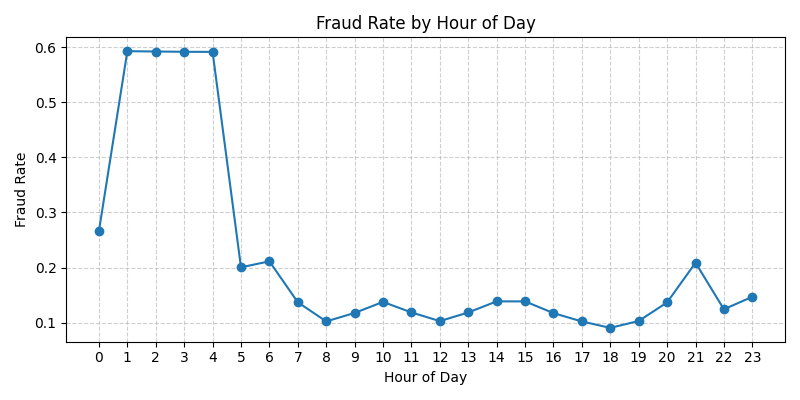

---

### 🛍️ 2. Уровень мошенничества по категории продавца  
**Файл:** `plots/vendor_category.png`  
Категории продавцов с наибольшим уровнем мошенничества.

---

### 💳 3. Уровень мошенничества по типу карты  
**Файл:** `plots/card_type.png`  
Сравнение частоты мошенничества для разных типов карт (дебетовая, кредитная и т.д.).

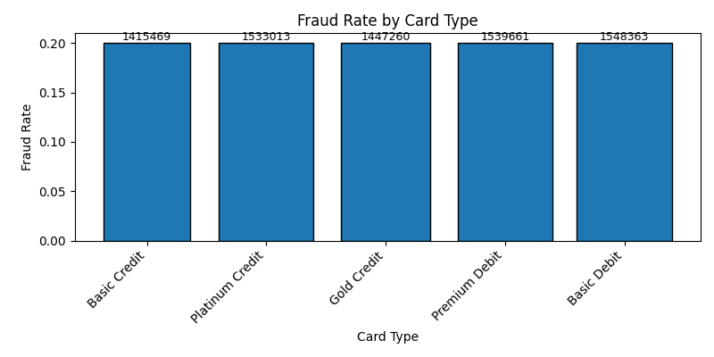

---

### 📲 4. Уровень мошенничества по каналу транзакции  
**Файл:** `plots/channel.png`  
Сравнение онлайн, POS, мобильных и других каналов.

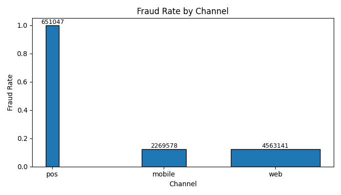

---

### 💵 5. Уровень мошенничества по сумме транзакции  
**Файл:** `plots/amount_usd.png`  
Разбивка по диапазонам сумм — от `<10` до `5000+`.

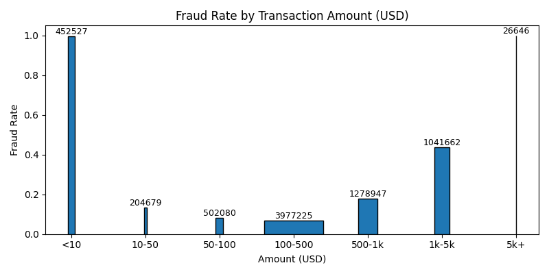

---

### 🧾 6. Уровень мошенничества в зависимости от присутствия карты  
**Файл:** `plots/card_presence.png`  
Оценивается, влияет ли наличие карты на вероятность мошенничества.

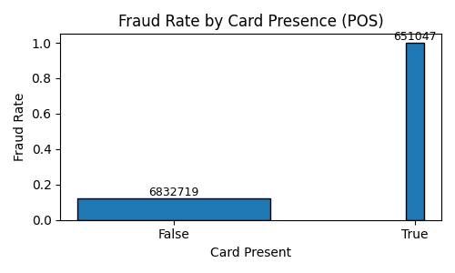

---

### 🔴 7. Уровень мошенничества у рискованных продавцов  
**Файл:** `plots/vendor_risk.png`  
Сравнение между high-risk и обычными продавцами.

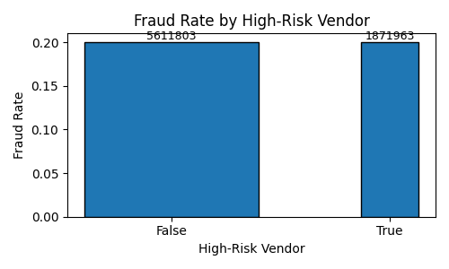

---

### 📅 8. Уровень мошенничества в выходные  
**Файл:** `plots/is_weekend.png`  
Анализ разницы между буднями и выходными.

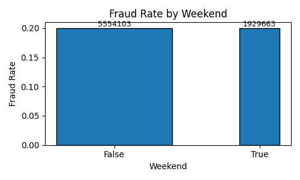

---

### 🔁 9. Уровень мошенничества по числу транзакций за последний час  
**Файл:** `plots/n_transactions.png`  
Позволяет выявить аномальную активность (например, ботов).

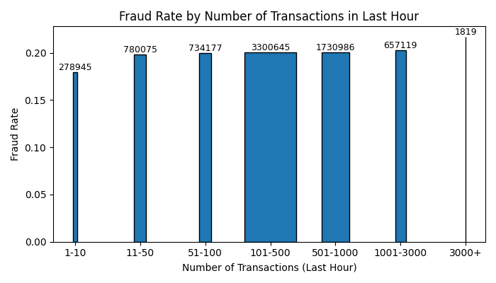

---

### 🌍 10. Уровень мошенничества по странам  
**Файл:** `plots/country.png`  
Горизонтальный барчарт по странам. Отражает уровень мошенничества в разрезе стран.

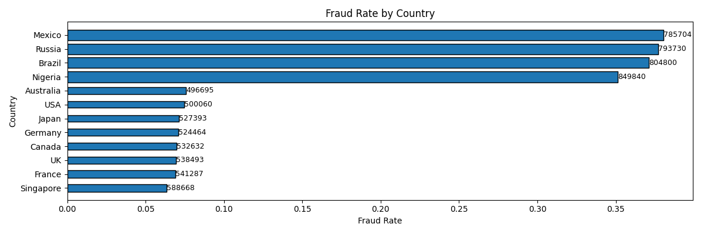

---

### ✈️ 11. Уровень мошенничества при транзакциях вне страны  
**Файл:** `plots/outside_home_country.png`  
Оценивает, чаще ли мошенничество происходит за пределами родной страны.

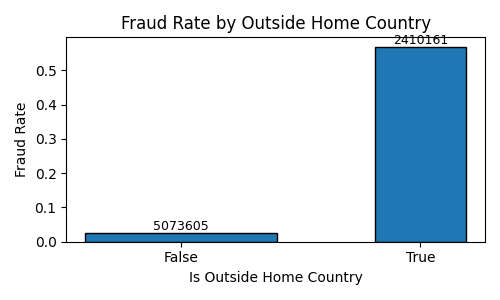

---

### 🏪 12. Уровень мошенничества по типу продавца  
**Файл:** `plots/vendor_type.png`  
Сравнение по типу продавца (например, физлицо, бизнес и т.д.).

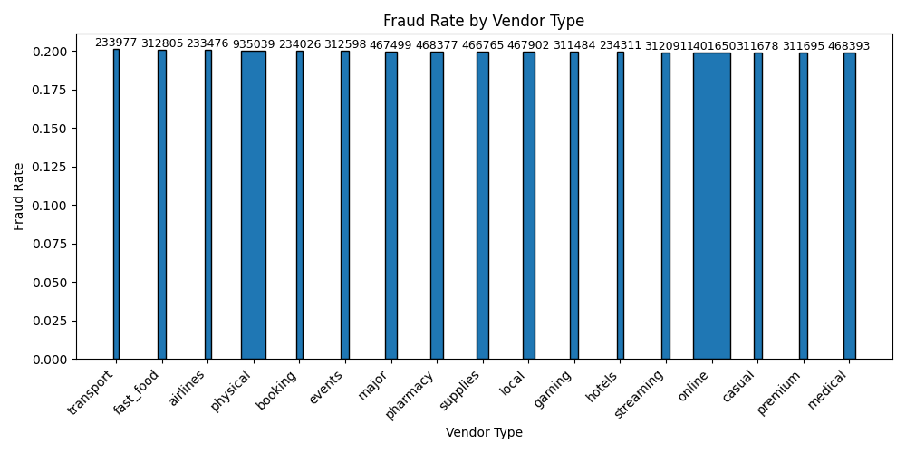

---

### 📱 13. Уровень мошенничества по устройствам  
**Файл:** `plots/device.png`  
Какие устройства чаще используются при мошеннических действиях.

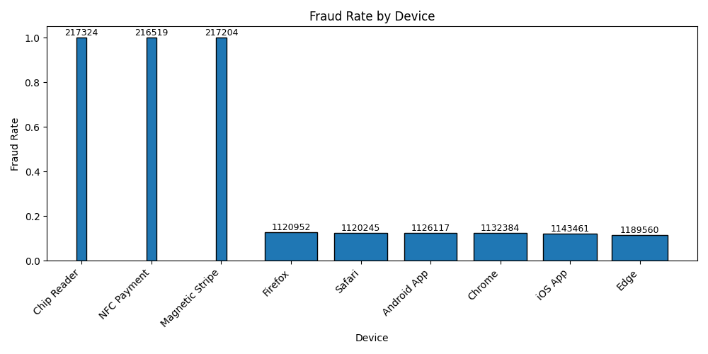

---

### 🌐 14. Процент мошенничества **вне родной страны среди всех мошеннических транзакций**  
**Файл не сохраняется, только отображение.**  
Показывает долю зарубежных транзакций среди всех мошеннических.

---

## 📝 Примечания

- Ширина столбцов указывает на объём данных в категории.
- Все графики выполнены с помощью **только Matplotlib**.
- Подписи над столбцами — это количество транзакций.

---

